<!-- _class: capa -->

<div class="emoji">📝</div>

# Projeto: Lista de Tarefas

## Aula 12 · Bloco 3 — O Navegador e o DOM

<div class="meta">Sem conteúdo novo — só integração. E o projeto vai para o ar.</div>

---

## 🎯 Nesta aula

Hoje não há conceito novo. Há **integração**.

1. A arquitetura: **estado → eventos → renderização**
2. Construir em **quatro etapas**
3. **Publicar no GitHub Pages** — de graça, na internet

É o "olá mundo" das aplicações de verdade.

---

<!-- _class: diagrama -->

## A arquitetura



---

<!-- _class: lead -->

## 📏 A regra de ouro do projeto

Os eventos **nunca** mexem na tela diretamente.

Eles mexem no **array** e chamam `renderizar()`,
que redesenha tudo a partir do estado.

**Uma única fonte de verdade.**

---

## A estrutura

```
aula-12-lista-tarefas/
├── index.html
├── style.css      ← fornecido pronto: o foco é o JS
└── script.js
```

O HTML tem o essencial: um `input`, um botão, um `<p>` de contador e uma `<ul>` **vazia** — que o JavaScript vai preencher.

---

## Etapa 1 — Estado e renderização

```javascript
const tarefas = [];   // cada item: { texto: "...", concluida: false }

const renderizar = () => {
  lista.innerHTML = "";              // limpa e redesenha do zero
  tarefas.forEach((tarefa, indice) => {
    const li = document.createElement("li");
    li.textContent = tarefa.texto;
    if (tarefa.concluida) li.classList.add("concluida");
    lista.appendChild(li);
  });
  contador.textContent = tarefas.filter((t) => !t.concluida).length;
};
```

---

## Etapa 2 — Adicionar, com validação

```javascript
const adicionar = () => {
  const texto = campo.value.trim();
  if (texto === "") return;                    // guard clause

  tarefas.push({ texto, concluida: false });   // altera o ESTADO
  campo.value = "";
  renderizar();                                // e redesenha
};

btnAdicionar.addEventListener("click", adicionar);
campo.addEventListener("keydown", (e) => e.key === "Enter" && adicionar());
```

---

## Etapas 3 e 4 — Concluir e remover

```javascript
li.addEventListener("click", () => {
  tarefa.concluida = !tarefa.concluida;   // inverte e redesenha
  renderizar();
});

btnRemover.addEventListener("click", (e) => {
  e.stopPropagation();          // impede que o clique também CONCLUA
  tarefas.splice(indice, 1);
  renderizar();
});
```

> ⚠️ Sem o `stopPropagation()`, clicar no ✕ removeria **e** marcaria como concluída.

---

<!-- _class: lead -->

## 🚀 Agora o momento mais legal do curso

Colocar o seu projeto **na internet.**

De graça.

**GitHub Pages**

---

## Publicando em cinco passos

1. Repositório **novo e público**: `lista-de-tarefas`;
2. `index.html`, `style.css` e `script.js` **na raiz** — commit e push;
3. No GitHub: **Settings → Pages**;
4. *Source*: **Deploy from a branch** · *Branch*: **main** · pasta **/ (root)** → **Save**;
5. Espere ~1 minuto e recarregue. O endereço aparece no topo:

```
https://SEU-USUARIO.github.io/lista-de-tarefas/
```

---

<!-- _class: lead -->

## 💡 E a partir de agora

Todo `git push` no `main`
**atualiza o site sozinho**, em ~1 minuto.

O seu fluxo Git agora publica software na internet.

É exatamente o que um deploy profissional faz.

---

<!-- _class: checkpoint -->

## 🏋️ Melhorias para entregar — escolha ao menos 2

1. Botão **"Limpar concluídas"**;
2. **Filtros**: Todas / Pendentes / Concluídas, via `filter`;
3. **Contador de caracteres** no campo;
4. **Prioridade** com `<select>` e classe de destaque;
5. 🌶️ **Persistência** com `localStorage` + `JSON.stringify/parse`.

**Entrega:** repositório próprio, publicado no Pages, link no README e histórico de commits mostrando as etapas — não um commit único.

---

<!-- _class: lead -->

## 🏁 Fim do Bloco 3

Você tem um aplicativo **no ar**, feito por você.

**Bloco 4 — Assincronismo**

Próxima parada: buscar dados
do mundo real, com APIs.
