<!-- _class: capa -->

<div class="emoji">🎓</div>

# Revisão e Próximos Passos

## Aula 16 · Bloco 4 — Assincronismo

<div class="meta">O mapa do que você aprendeu — e para onde ir agora</div>

---

## 🎯 Nesta aula

1. **O mapa do curso** em uma tela
2. **Classes em JavaScript** — a ponte com Java
3. O que deixamos de fora — de propósito
4. O portfólio que você já tem

---

<!-- _class: diagrama -->

## O curso inteiro



---

<!-- _class: lead -->

## 🧱 Programação é acumulativa

Os **callbacks** do Bloco 2 viraram *event listeners* no Bloco 3.

Os **objetos e o JSON** do Bloco 2 viraram respostas de API no Bloco 4.

A **validação** do Bloco 3 protegeu o `fetch` do Bloco 4.

Nada foi jogado fora.

---

## Classes em JavaScript

```javascript
class Aluno {
  constructor(nome) {
    this.nome = nome;
    this.notas = [];
  }
  adicionarNota(nota) { this.notas.push(nota); }
  calcularMedia() {
    return this.notas.reduce((acc, n) => acc + n, 0) / this.notas.length;
  }
}

const maria = new Aluno("Maria");
```

---

## A mesma ideia, em Java

```java
public class Aluno {
    private String nome;
    private ArrayList<Double> notas = new ArrayList<>();

    public Aluno(String nome) { this.nome = nome; }
    public void adicionarNota(double nota) { notas.add(nota); }
}
```

**Igual:** `class`, construtor, `this`, métodos, `new`. **Muda:** Java declara **tipos** em tudo e tem `private` / `public`.

---

<!-- _class: lead -->

## 💡 Um exercício mental valioso

Pegue qualquer exercício do Bloco 2
e pense em como ele ficaria **em Java**.

Traduzir entre linguagens consolida os **conceitos** —
que é o que realmente importa.

A sintaxe muda. A lógica, não.

---

<!-- _class: lista-limpa -->

## O roteiro pós-curso, em ordem

- 1️⃣ **`localStorage`** — persistir dados no navegador;
- 2️⃣ **CSS de verdade** — Flexbox e Grid;
- 3️⃣ **npm** — usar pacotes de terceiros (aí o `node_modules/` no `.gitignore` faz sentido);
- 4️⃣ **`this`, protótipos, closures** — os mecanismos internos do JS;
- 5️⃣ **TypeScript** — JS com tipos. Depois de Java, você vai *entender por quê*;
- 6️⃣ **Um framework** — React ou Vue, só depois de DOM puro;
- 7️⃣ **Node como back-end** — deixar de consumir APIs para **criá-las**.

---

<!-- _class: lead -->

## ⚠️ Sobre pular direto para o framework

Você agora sabe **o que os frameworks automatizam**.

Quem começou direto no React
não sabe — e essa base vai faltar.

Não tenha pressa de pular etapa.

---

<!-- _class: lista-limpa -->

## Seu portfólio já começou

Faça o inventário no seu GitHub:

- 📁 Repositório de exercícios com **16 pastas** e dezenas de commits;
- 🌐 **Lista de tarefas publicada** no GitHub Pages;
- 🤝 Um **Pull Request aceito** no trabalho em dupla;
- 🚀 O **projeto final** no ar, com README.

Isso é portfólio inicial **real**. É exatamente o que se olha em candidatos a estágio.

---

<!-- _class: checkpoint -->

## 🏋️ Exercício final integrador

`aula-16/quiz-revisao/` — sem consultar as aulas:

1. Classe `Produto` com `nome`, `preco` e `precoComDesconto(percentual)`;
2. Array com 5 instâncias via `new Produto(...)`;
3. Com métodos funcionais: nomes acima de R$ 100, total do estoque, o mais barato;
4. Renderize numa página, com busca filtrando **enquanto digita** (evento `input`);
5. Commite com uma boa mensagem e dê push. 😉

---

<!-- _class: lead -->

## 🎓 Fim do curso

Você começou sem saber o que era uma variável em JS.

Terminou publicando aplicações
que consomem APIs reais,
com fluxo de trabalho profissional.

**Siga commitando.**
